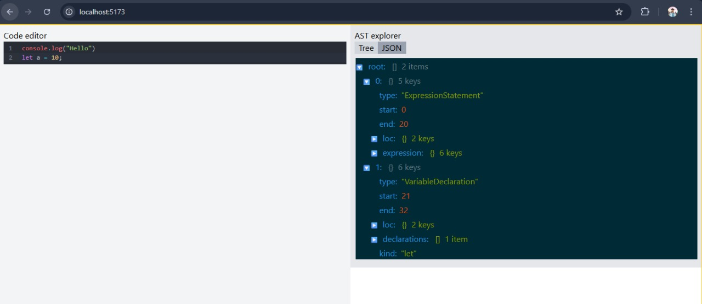

# AST Explorer

A lightweight **Abstract Syntax Tree (AST) Explorer** built with **React, CodeMirror, react-json-tree, and Node.js (Babel Parser)**.
This tool lets you type JavaScript/TypeScript code and instantly see the generated AST in both **tree view** and **raw JSON view**.

---

## 🚀 Features

* **Live Code Editor** using [CodeMirror](https://uiwjs.github.io/react-codemirror/).
* **AST Generation** powered by [@babel/parser](https://babeljs.io/docs/babel-parser).
* **Tree View** with [react-json-tree](https://github.com/reduxjs/redux-devtools/tree/main/packages/react-json-tree).
* Toggle between:

  * 🌳 **Tree View** – Explore the AST hierarchy visually.
  * 📄 **JSON View** – Inspect the raw AST JSON.


---

## 🛠️ Tech Stack

**Frontend**

* React + Vite
* CodeMirror 6
* react-json-tree


**Backend**

* Node.js + Express
* @babel/parser
* CORS enabled API for AST parsing

---

## 📦 Installation & Setup

### 1. Clone the repo

```bash
git clone https://github.com/your-username/ast-explorer.git
cd ast-explorer
```

### 2. Install dependencies

```bash
# Install frontend deps
cd frontend
npm install

# Install backend deps
cd ../backend
npm install
```

### 3. Run backend

```bash
cd backend
npm start
# server runs on http://localhost:3000
```

### 4. Run frontend

```bash
cd frontend
npm run dev
# frontend runs on http://localhost:5173
```

---

## 📷 Demo

Type JavaScript/TypeScript code in the editor →
AST JSON + tree view updates instantly!




---

## 📝 License

MIT License
